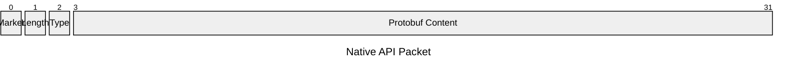
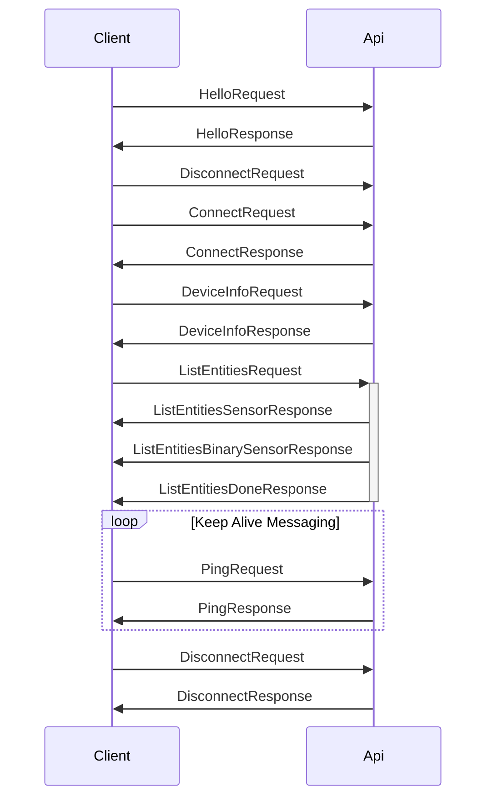

# Missing Native API Documentation

- TCP Based

## Packet Format

From: https://github.com/esphome/aioesphomeapi/blob/main/aioesphomeapi/connection.py#L700
https://github.com/esphome/aioesphomeapi/blob/main/aioesphomeapi/_frame_helper/plain_text.py#L41

| Part | Description         | Example                                                  |
| ---- | ------------------- | -------------------------------------------------------- |
| 0    | Preamble (always zero byte) | `0x00`                                                   |
| 1    | Message Length      | `0x00`                                                   |
| 2    | Message Type        | 0x01 (Internal number for identifying the proto message) |
| 3-X  | Content             |

Message Types: (https://github.com/esphome/aioesphomeapi/blob/main/aioesphomeapi/core.py#L290)

## Example Communication

## Entities

- Sensor
https://github.com/esphome/aioesphomeapi/blob/e14b6ec9315695ba13e7cf6b750bc892b77a0a2e/aioesphomeapi/model.py#L433