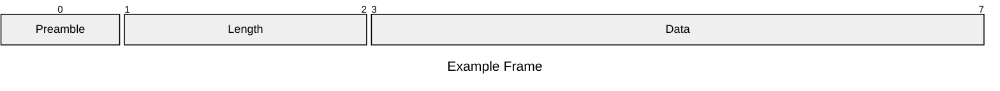
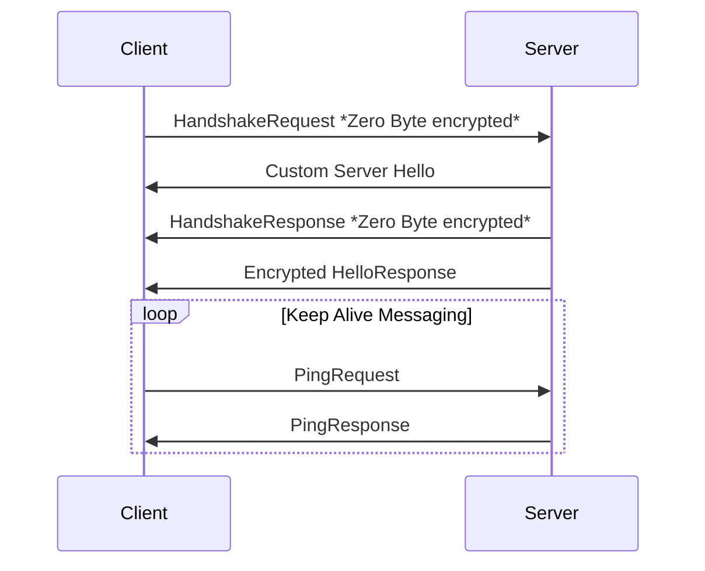
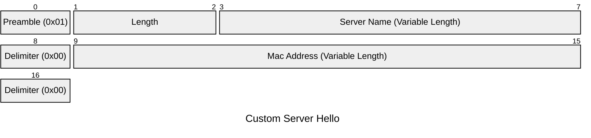
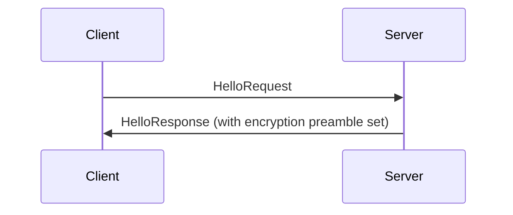
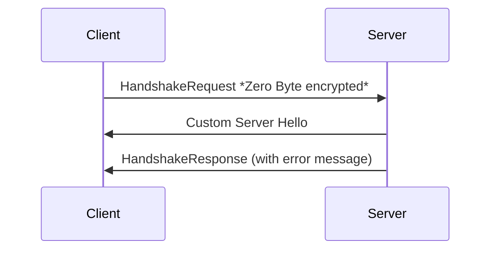
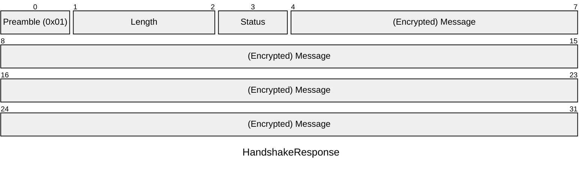

# Encryption

> Recently Added by the ESPHome Team: https://developers.esphome.io/architecture/api/protocol_details/

It uses the Noise Protocol Framework, specifically the `Noise_NNpsk0_25519_ChaChaPoly_SHA256` pattern.

The Encryption protocol is reusing the base frame format and the packet format (although encrypted).
But some parts are predetermined instead of variable:

- No VarInt Length, the length is always 2 bytes (an unsigned 16-bit integer in big-endian format).

| Part     | Bits     | Description                                                           | Example              |
| -------- | -------- | --------------------------------------------------------------------- | -------------------- |
| Preamble | 1        | Marker bit which states if unencrypted (`0x00`) or encrypted (`0x01`) | `0x00`               |
| Length   | 2        | Length of the Data (an unsigned 16-bit integer in big-endian format)  | `0x0016` or `0x0001` |
| Data     | 0-16,383 | [Encrypted](./encryption.md) or [unencrypted Packet](#packet)         |                      |

## Initialization of the encryption protocol

1. Handshake Request is send by the client (which is just a zero byte encrypted message)
2. The Server responds with a Custom Server Hello message:

| Part        | Bits      | Description                                                           | Example                  |
| ----------- | --------- | --------------------------------------------------------------------- | ------------------------ |
| Preamble    | 1         | Marker bit which states if unencrypted (`0x00`) or encrypted (`0x01`) | `0x00`                   |
| Length      | 1-2       | Length of the Data (an unsigned 16-bit integer in big-endian format)  | `0x16` or `0xFFFFFFFFFF` |
| Server Name | 3-X       | Name of the Server                                                    | `test_server`            |
| Delimiter   | X + 1     | Zero Byte Delimiter                                                   | `0x00`                   |
| Mac Address | X + 2 - Y | Mac Address of the Server                                             | `00:11:22:33:44:55`      |
| Delimiter   | Y + 1     | Zero Byte Delimiter                                                   | `0x00`                   |

3. It then send a Handshake Response, which is also a zero byte encrypted message.
4. Finally, the server sends an encrypted HelloResponse message.

Notes:

- for api encryption the mdns entry needs to be added: `"api_encryption=Noise_NNpsk0_25519_ChaChaPoly_SHA256"`

### Errors

#### Client connects without encryption

1. HelloRequest is sent by the client.
2. The Server responds with a HelloResponse with the encryption preamble set to `0x01` (indicating that the server requires encryption).
3. Connection is closed by the server.

#### Client connects with wrong encryption key

1. HelloRequest is sent by the client.
2. The Server responds with a Custom Server Hello message (see [above](#initialization-of-the-encryption-protocol)).
3. The Server responds with a HandshakeResponse with an error message
4. The connection is closed by the server.

| Part                | Bits | Description                                                                                                                                                                 | Example                  |
| ------------------- | ---- | --------------------------------------------------------------------------------------------------------------------------------------------------------------------------- | ------------------------ |
| Preamble            | 1    | Marker bit which states if unencrypted (`0x00`) or encrypted (`0x01`)                                                                                                       | `0x00`                   |
| Length              | 1-2  | Length of the Data (an unsigned 16-bit integer in big-endian format)                                                                                                        | `0x16` or `0xFFFFFFFFFF` |
| Status              | 3    | Status of the Handshake (0x00 = Success, 0x01 = Failure)                                                                                                                    | `0x00`                   |
| (Encrypted) Message | 4-X  | If the Status indicates success the message will be an encrypted zero byte array. If the Status indicates a Failure it contains an unencrypted utf-8 encoded error message. | `0x00`                   |
