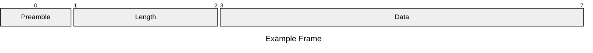
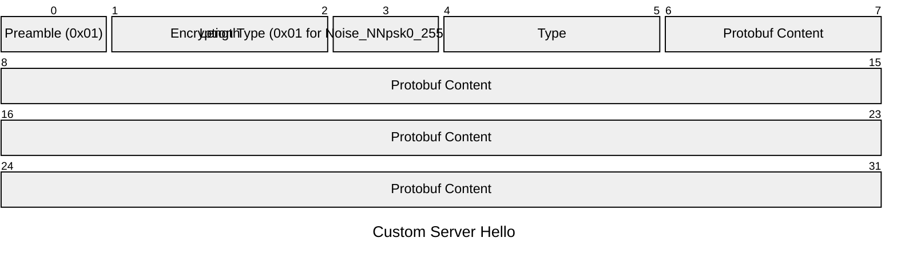

# Encryption

> Recently Added by the ESPHome Team: https://developers.esphome.io/architecture/api/protocol_details/

It uses the Noise Protocol Framework, specifically the `Noise_NNpsk0_25519_ChaChaPoly_SHA256` pattern.

The Encryption protocol is reusing the base frame format and the packet format (although encrypted).
But some parts are predetermined instead of variable:

- No VarInt Length, the length is always 2 bytes (an unsigned 16-bit integer in big-endian format).

| Part     | Bits     | Description                                                           | Example            |
| -------- | -------- | --------------------------------------------------------------------- | ------------------ |
| Preamble | 1        | Marker bit which states if unencrypted (`0x00`) or encrypted (`0x01`) | `0x00`             |
| Length   | 2        | Length of the Data (an unsigned 16-bit integer in big-endian format)                                                   | `0x0016` or `0x0001` |
| Data     | 0-16,383 | [Encrypted](./encryption.md) or [unencrypted Packet](#packet)         |                    |

## Initialization of the encryption protocol

1. Handshake Request is send by the client (which is just a zero byte encrypted message)
2. The Server responds with a Custom Server Hello message:

| Part     | Bits             | Description                                                                                                                                                              | Example                  |
| -------- | ---------------- | ------------------------------------------------------------------------------------------------------------------------------------------------------------------------ | ------------------------ |
| Preamble | 1                | Marker bit which states if unencrypted (`0x00`) or encrypted (`0x01`)                                                                                                    | `0x00`                   |
| Length   | 1-5              | Variable Message Length according to [VarInt Specification](https://protobuf.dev/programming-guides/encoding/) (encrypted frames ignore the spec and always use 2 bytes) | `0x16` or `0xFFFFFFFFFF` |
| Data     | 0-34,359,738,367 | [Encrypted](./encryption.md) or [unencrypted Packet](#packet)                                                                                                            |                          |

3. It then send a Handshake Response, which is also a zero byte encrypted message.
4. Finally, the server sends an encrypted HelloResponse message.

Notes:

- for api encryption the mdns entry needs to be added: `"api_encryption=Noise_NNpsk0_25519_ChaChaPoly_SHA256"`
