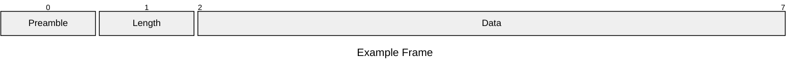
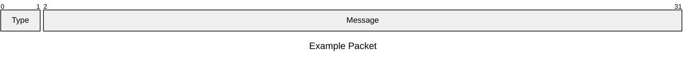
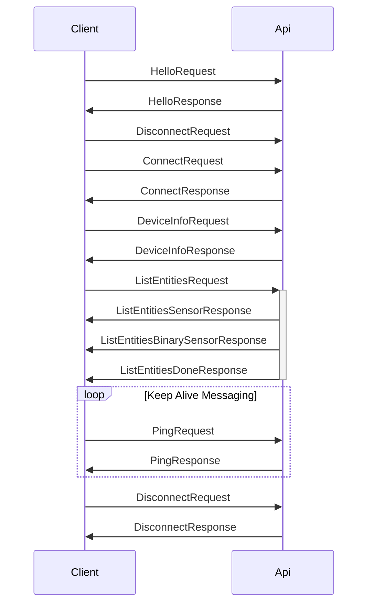

# General

The messaging protocol is based on protobuf messages, with

## Frame Format [^1]

| Part     | Bits     | Description                                                                                                   | Example                  |
| -------- | -------- | ------------------------------------------------------------------------------------------------------------- | ------------------------ |
| Preamble | 1        | Marker bit which states if unencrypted (`0x00`) or encrypted (`0x01`)                                         | `0x00`                   |
| Length   | 1-5      | Variable Message Length according to [VarInt Specification](https://protobuf.dev/programming-guides/encoding/) (encrypted frames ignore the spec and always use 2 bytes)| `0x16` or `0xFFFFFFFFFF` |
| Data     | 0-34,359,738,367 | [Encrypted](./encryption.md) or [unencrypted Packet](#packet)                                   |                          |

### Packet

| Part    | Description                                                                                                                                                                                      | Example               |
| ------- | ------------------------------------------------------------------------------------------------------------------------------------------------------------------------------------------------ | --------------------- |
| Type    | Internal number for identifying the proto message => [Link to custom mapping](https://github.com/esphome/aioesphomeapi/blob/71bcda2c2cf9aecf3843c01937a24e012f7a3244/aioesphomeapi/core.py#L321) | `0x01` (HelloMessage) |
| Message | Content                                                                                                                                                                                          |                       |

## Example Communication

[^1]:
    From: [https://github.com/esphome/aioesphomeapi/blob/main/aioesphomeapi/connection.py#L700](https://github.com/esphome/aioesphomeapi/blob/main/aioesphomeapi/connection.py#L700)
    [https://github.com/esphome/aioesphomeapi/blob/main/aioesphomeapi/\_frame_helper/plain_text.py#L41](https://github.com/esphome/aioesphomeapi/blob/main/aioesphomeapi/_frame_helper/plain_text.py#L41)
