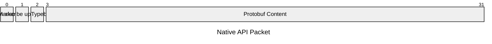
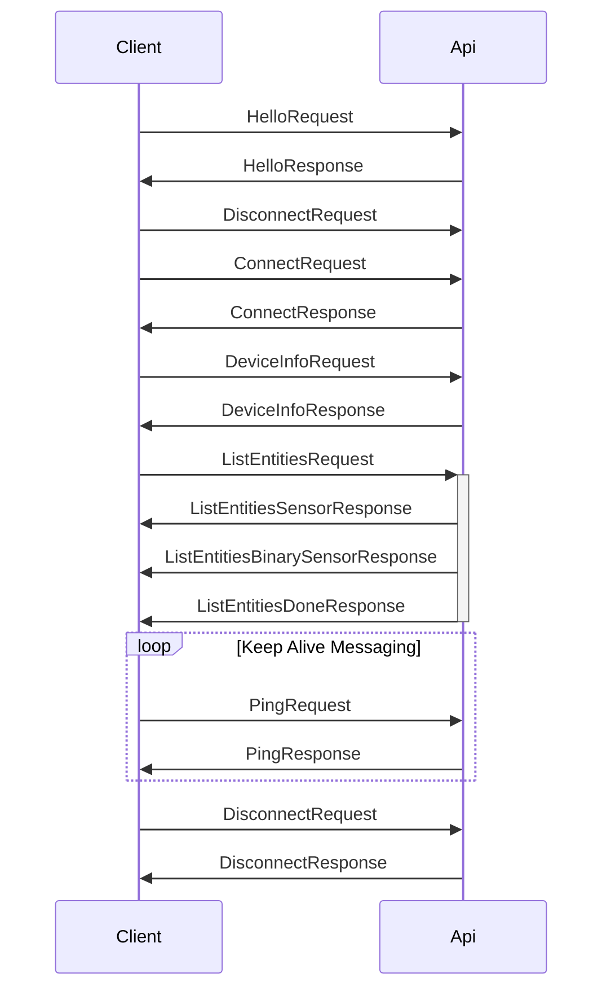

# General

## Packet Format  [^1]

| Part | Description                                                           | Example |
| ---- | --------------------------------------------------------------------- | ------- |
| 0    | Preamble (always zero byte)                                           | `0x00`  |
| 1    | Message Length                                                        | `0x00`  |
| 2    | Message Type (Internal number for identifying the proto message => [Link to custom mapping](https://github.com/esphome/aioesphomeapi/blob/71bcda2c2cf9aecf3843c01937a24e012f7a3244/aioesphomeapi/core.py#L321)) | 0x01    |
| 3-X  | Content                                                               |

## Example Communication

[^1]: 
  From: [https://github.com/esphome/aioesphomeapi/blob/main/aioesphomeapi/connection.py#L700](https://github.com/esphome/aioesphomeapi/blob/main/aioesphomeapi/connection.py#L700)
  [https://github.com/esphome/aioesphomeapi/blob/main/aioesphomeapi/_frame_helper/plain_text.py#L41](https://github.com/esphome/aioesphomeapi/blob/main/aioesphomeapi/_frame_helper/plain_text.py#L41)
